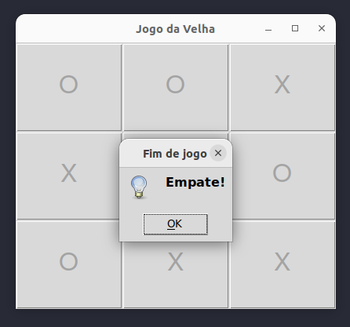
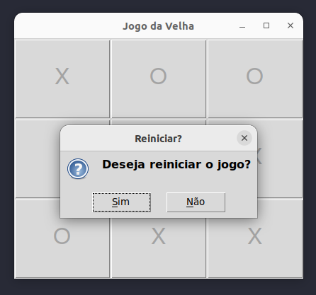

<!-- **!! Atenção: Renomeie o seu repositório para (Tema)\_(NomeDoProjeto). !!**

Temas:

- Grafos1
- Grafos2
- PD
- D&C
- Greed
- Final

**!! _Não coloque os nomes dos alunos no título do repositório_. Exemplo de título correto: Grafos2_Labirinto-do-Minotauro !!**

(Apague essa seção)
 -->

# Jogo da Velha Impossível

<!-- **Número da Lista**: X<br> -->

**Conteúdo da Disciplina**: Grafos 1<br>

## Alunos

| :Matrícula: | :Aluno                        |
| ----------- | ----------------------------- |
| 20/2023743  | Iago de Sousa Campelo Matos   |
| 21/1043683  | Marcus Vinícius Paiva Martins |

## Sobre

O objetivo do projeto é criar um jogo da velha utlilizando uma matriz de adjacência 3x3 na sua implementação, buscando nas proximidades de cada jogada se é formado um trio consecutivo de mesmo símbolo (no sentido horizontal, vertical ou digonal) ou se a matriz está completa e o jogo empatou. É definido que a resposta da máquina seja a melhor jogada possível naquele contexto, dificultando a vitória do jogador

## Screenshots

<span> </span>

</br>

<span> </span>

## Instalação

**Linguagem**: Python<br>

Para rodar o projeto, é necessário que o suporte a linguagem Python esteja instalado na máquina, assim como a ferramenta [Tkinter](https://docs.python.org/pt-br/3/library/tkinter.html).

- **Ubuntu**

  No terminal, faça:

  ```Plain Text
  sudo apt-get install python3
  sudo apt install python3-tk
  ```

  Ainda no terminal, na pasta do projeto:

  ```Plain Text
  python3 main.py
  ```

- **Windows**

  Primeiro, faça o [download oficial da linguagem](https://www.python.org/downloads/).

  Depois, no diretório do projeto no terminal:

  ```Plain Text
  python3 main.py
  ```

## Uso

Após rodar os comandos acima o Jogo da Velha Impossível deve abrir em outra janela e é necessário iniciar o jogo clicando em algum dos 9 quadrados. O jogador joga com o símbolo `X`, enquanto a máquina joga com `O`. O objetivo do jogador é formar um trio consecutivo de mesmos símbolos no sentido horizontal, vertical ou diagonal. Ao fim do jogo, será indicada uma vitória, derrota ou empate, além da possíbilidade de jogar novamente.

<!-- ## Outros

Quaisquer outras informações sobre seu projeto podem ser descritas abaixo. -->
