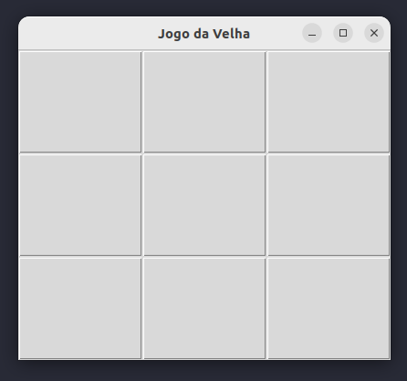
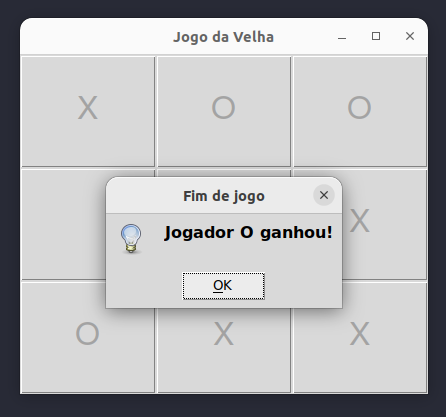
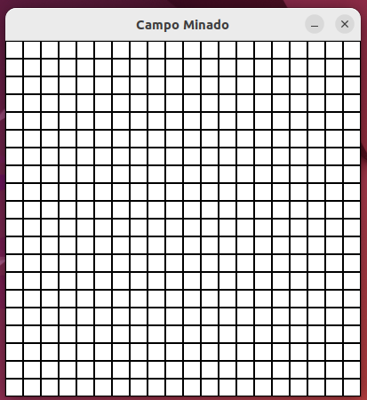
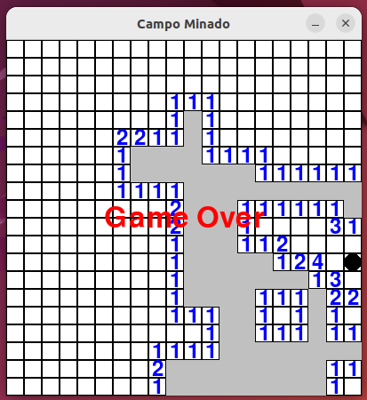
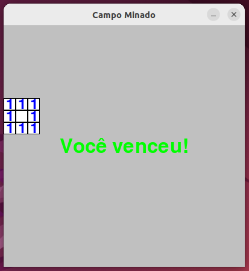
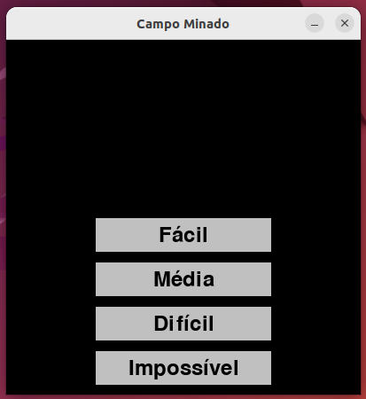

# Minigames com Grafos1

**Conteúdo da Disciplina**: Grafos 1<br>

## Alunos

| :Matrícula: | :Aluno                        |
| ----------- | ----------------------------- |
| 20/2023743  | Iago de Sousa Campelo Matos   |
| 21/1043683  | Marcus Vinícius Paiva Martins |

## Sobre

O objetivo do projeto é desenvolver dois jogos distintos, o Jogo da Velha e o Campo Minado, aplicando os conceitos e técnicas aprendidos na disciplina de Projeto de Algoritmos. No Jogo da Velha, será utilizado uma matriz de adjacência 3x3 na implementação, e o objetivo é verificar nas proximidades de cada jogada se é formado um trio consecutivo de mesmo símbolo (no sentido horizontal, vertical ou diagonal) ou se a matriz está completa, resultando em um empate. A máquina responderá com a melhor jogada possível para dificultar a vitória do jogador.

Quanto ao Campo Minado, a abordagem incluirá a implementação de um algoritmo BFS (Busca em Largura) para revelar os campos vazios no tabuleiro com uma pausa entre as interações para visualizar a busca.

### Vídeo de explicação

[Sharepoint](https://unbbr.sharepoint.com/sites/Tubaro/Documentos%20Compartilhados/General/Recordings/Reuni%C3%A3o-20230925_233943-Grava%C3%A7%C3%A3o%20de%20Reuni%C3%A3o.mp4?web=1)

## Screenshots

### Jogo da Velha

<span> </span>

</br>

<span> </span>

### Campo Minado

<span> </span>

<span> </span>

## Instalação

**Linguagem**: Python<br>

Para rodar o projeto, é necessário que o suporte a linguagem Python esteja instalado na máquina, assim como a ferramenta [Tkinter](https://docs.python.org/pt-br/3/library/tkinter.html).

- **Ubuntu**

  No terminal, faça:

  ```Plain Text
  sudo apt-get install python3
  sudo apt install python3-tk
  pip install pygame
  ```

  Ainda no terminal, na pasta do projeto:

  ```Plain Text
  python3 jogodavelha.py
  ```

  ou

  ```Plain Text
  python3 campominado.py
  ```

- **Windows**

  Primeiro, faça o [download oficial da linguagem](https://www.python.org/downloads/). Depois:

  ```Plain Text
  pip install pygame
  ```

  Depois, no diretório do projeto no terminal:

  ```Plain Text
  python3 jogodavelha.py
  ```

  ou

  ```Plain Text
  python3 campominado.py
  ```

## Uso

Após rodar os comandos acima o Jogo da Velha Impossível deve abrir em outra janela e é necessário iniciar o jogo clicando em algum dos 9 quadrados. O jogador joga com o símbolo `X`, enquanto a máquina joga com `O`. O objetivo do jogador é formar um trio consecutivo de mesmos símbolos no sentido horizontal, vertical ou diagonal. Ao fim do jogo, será indicada uma vitória, derrota ou empate, além da possíbilidade de jogar novamente.

O Campo Minado é um jogo de lógica e estratégia que geralmente é jogado em um tabuleiro retangular, no qual você deve revelar todos os campos vazios sem detonar as minas escondidas. Os valores nos quadrados revelados indicam as minas adjacentes, clique nos quadrados para revelar o que existe ali.
